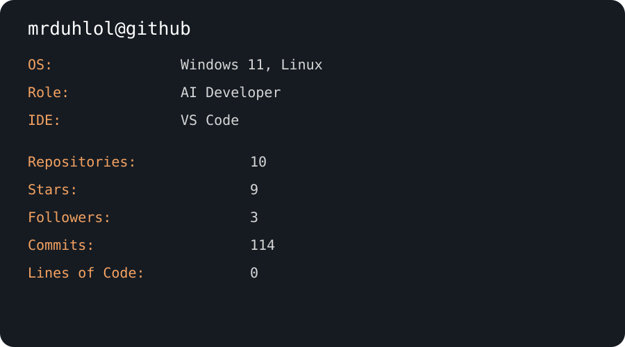

<div align="center">



<br>

<p>
  
</p>

</div>

---

## 👋 About Me

```text
Name      :: Abhishek A
Username  :: mrduhlol
Role      :: Student • AI Developer
Location  :: Bangalore, India
Learning  :: AI • Robotics • Full Stack
Currently :: Building FlipDeck 🎮
```

---

## 🛠 Tech Stack

<p align="center">

</p>

---

## 📊 GitHub Stats

<p align="center">


</p>

---

## 🔥 GitHub Streak

<p align="center">


</p>

---

## 📈 Contribution Graph

<p align="center">


</p>

---

## 🏆 GitHub Trophies

<p align="center">


</p>

---

## 🚀 Featured Projects

| Project | Description |
|---------|-------------|
| 🎮 FlipDeck | Multiplayer UNO-inspired web game built with React + TypeScript |
| 📂 ByteDrop | Fast file sharing between devices |
| 🏏 Cricket Dude | Cricket CLI using CricketData API |
| ⏰ Python Clock | Terminal alarm & digital clock |

---

## 📫 Connect

<p align="center">

<a href="mailto:abhishek.a2534@gmail.com">

</a>

<a href="https://github.com/mrduhlol">

</a>

</p>

---

<div align="center">

### ⭐ Thanks for visiting!

*"Dang!! Look who's here."*

</div>